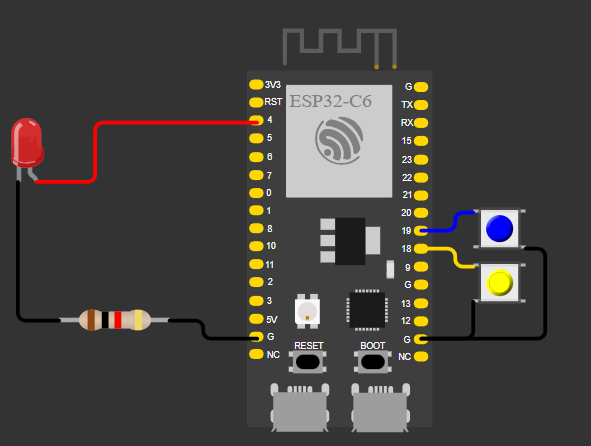

# Task exercise

**Purpose of the session:**

_Develop and test an advanced FreeRTOS system using mutexes, queues with structs, heartbeat supervision, and centralized error logging._

## Lab 1 

### 1) Activity Goals  

+ _Extend the FreeRTOS multitasking system by integrating heartbeat monitoring, structured queue communication, mutex-protected shared resources, and centralized error handling._

+ _Validate synchronization mechanisms (mutex), structured message passing (queues with structs), and system robustness under simulated error conditions._

+ _Document the system architecture, task interactions, error management strategy, and observed runtime behavior._


### 2)Exercises  
1) _Heartbeat + work task_  
2) _Add a third task that prints “alive” every 2 seconds._  
3) _Queue with struct_  
4) Send a struct: ```{int id; int value;}```_  
5) _Mutex around a shared peripheral_  
6) _Make two tasks write to the same log message format (simulate “shared UART resource”) and guard it with a mutex._  
7) _Log any error (message of any error)_

### 3) Materials & Setup  
BOM (bill of materials)

|#|Item|Qty|Link/Source|Cost (MXN)|Notes|
|---------|--------|------|--------|--------|--------|
|1|ESP32|1|amazon|$365|Nothing|
|2|Led|1|Electronic store|$3|Nothing|
|3|Push button|2|Electronic store|$2|Nothing|

**_Tools / Software_**   

* _OS/Env: ESP-IDF with FreeRTOS on ESP32 (Windows)_ 

* _Editors: VS Code with ESP-IDF extension, C/C++_  

* _Debug/Flash: ESP-IDF monitor and flashing tools_  

**_Wiring / Safety_**  

* _Board power: USB 5 V from host PC_  

* _Peripherals: LED (GPIO 4), Button 1 (GPIO 18), Button 2 (GPIO 19)_ 

* _Safety notes: Verify correct GPIO mapping, enable pull-ups for buttons, avoid short circuits_  
### 4) Procedure (what you did)  

* _**Step 1:** Created shared system resources including a mutex (counter_mutex), a message queue (msg_queue), and an error queue (error_queue)._  
* _**Step 2:** Implemented two increment tasks that safely update a shared counter using a mutex to ensure mutual exclusion._  
* _**Step 3:** Added a heartbeat task that toggles an LED and periodically reports system status, generating a fatal error after a defined number of cycles._  
* _**Step 4:** Implemented a producer task that sends structured messages `{int id; int value;}` to a queue._  
* _**Step 5:** Implemented a consumer task that receives and logs structured messages from the queue._  
* _**Step 6:** Added two button-monitoring tasks that detect simultaneous button presses and generate error events._  
* _**Step 7:** Implemented a centralized error logger task that receives error codes from an error queue and logs them._  
* _**Step 8:** Built, flashed, and monitored the application to validate correct synchronization, communication, and error handling behavior._
### 5) Data, Tests & Evidence  
**Test plan:** 

* _Inputs: Button presses, heartbeat cycles, producer message rate, shared counter access_  

**Expected:** 

- _Safe shared counter increments with no race conditions_  
- _Proper FIFO message transfer using struct-based queue_ 
- _Error events logged when triggered_  
- _Centralized error reporting via error_logger_task_     

**Tables/observations**  
Case | Configuration | Observed Behavior | System Stability | Pass?  
A | Mutex enabled for counter | Consistent counter increments | Stable |  
B | Struct queue active | Correct id/value received | Stable |  
C | Both buttons pressed | Error code generated and logged | Stable |  
D | Heartbeat fatal cycle triggered | Fatal error logged and recovered | Stable |  
E | Producer periodic error log | Error message printed | Stable |  

### 6) Analysis  

_The extended system demonstrates advanced multitasking coordination in FreeRTOS._  
_The mutex successfully protects the shared_counter variable, preventing race conditions between increment_task instances._  
_The struct-based queue ensures reliable FIFO communication between producer_task and consumer_task, demonstrating safe structured data transfer._  
_The heartbeat mechanism introduces supervised periodic system activity and simulated fatal conditions, validating system recovery logic._  
_Button monitoring tasks generate asynchronous events, which are safely handled through an error queue and centralized error_logger_task._


**_This architecture illustrates modular real-time system design using:_**  

- _Mutual exclusion (mutex)_  
- _Structured inter-task communication (queues with structs)_  
- _Event-driven error handling_  
- _Priority-based scheduling_  

**Proposed improvements:** 

* _Add priority inheritance testing, implement ISR-based button handling, or integrate watchdog supervision for enhanced fault tolerance._ 

### 7) Code  
```
#include <stdio.h>
#include "freertos/FreeRTOS.h"
#include "freertos/task.h"
#include "freertos/semphr.h"
#include "freertos/queue.h"
#include "esp_log.h"
#include "driver/gpio.h"

#define LED   GPIO_NUM_4
#define BTN1  GPIO_NUM_18
#define BTN2  GPIO_NUM_19

static const char *TAG  = "LAB3";
static const char *QTAG = "QUEUE";

typedef struct {
    int id;
    int value;
} message_t;

typedef enum {
    ERR_QUEUE_FULL = 1,
    ERR_BUTTON_STUCK,
    ERR_BOTH_BUTTONS_PRESSED,
    ERR_FATAL_HEARTBEAT
} error_t;

static volatile int shared_counter = 0;
static volatile int btn1_pressed = 0;
static volatile int btn2_pressed = 0;

static SemaphoreHandle_t counter_mutex;
static QueueHandle_t msg_queue;
static QueueHandle_t error_queue;

static void increment_task(void *pvParameters)
{
    const char *name = (const char *)pvParameters;

    while (1) {
        xSemaphoreTake(counter_mutex, portMAX_DELAY);
        shared_counter++;
        if ((shared_counter % 501) == 0) {
            ESP_LOGI(TAG, "%s sees counter=%d", name, shared_counter);
        }
        xSemaphoreGive(counter_mutex);
        vTaskDelay(pdMS_TO_TICKS(10));
    }
}

static void heartbeat_task(void *pvParameters)
{
    gpio_reset_pin(LED);
    gpio_set_direction(LED, GPIO_MODE_OUTPUT);

    int alive_cycles = 0;

    while (1) {

        if (alive_cycles < 8) {
            gpio_set_level(LED, 1);
            ESP_LOGI("HEARTBEAT", "alive");
            vTaskDelay(pdMS_TO_TICKS(2000));

            gpio_set_level(LED, 0);
            vTaskDelay(pdMS_TO_TICKS(2000));

            alive_cycles++;
        }

        else {
            gpio_set_level(LED, 0);
            ESP_LOGE("HEARTBEAT", "ERROR FATAL");

            error_t err = ERR_FATAL_HEARTBEAT;
            xQueueSend(error_queue, &err, 0);

            vTaskDelay(pdMS_TO_TICKS(4000));
            alive_cycles = 0;
        }
    }
}

static void producer_task(void *pvParameters)
{
    message_t msg;
    int value = 0;
    int error_timer = 0;

    while (1) {
        msg.id = 1;
        msg.value = value++;
        xQueueSend(msg_queue, &msg, portMAX_DELAY);

        error_timer++;
        if (error_timer >= 5) {
            ESP_LOGE("PRODUCER", "ERROR ENCONTRADO");
            error_timer = 0;
        }

        vTaskDelay(pdMS_TO_TICKS(1000));
    }
}

static void consumer_task(void *pvParameters)
{
    message_t msg;
    TickType_t last_error = xTaskGetTickCount();

    while (1) {
        if (xQueueReceive(msg_queue, &msg, portMAX_DELAY)) {
            ESP_LOGI(QTAG, "Received id=%d value=%d", msg.id, msg.value);
        }

        if ((xTaskGetTickCount() - last_error) >= pdMS_TO_TICKS(5000)) {
            ESP_LOGE("CONSUMER", "ERROR ENCONTRADO");
            last_error = xTaskGetTickCount();
        }
    }
}

static void button1_task(void *pvParameters)
{
    int last_state = 1;
    while (1) {
        int state = gpio_get_level(BTN1);
        if (state == 0 && last_state == 1) {
            ESP_LOGI("BTN1", "Button 1 pressed");
            btn1_pressed = 1;
            if (btn2_pressed) {
                error_t err = ERR_BOTH_BUTTONS_PRESSED;
                xQueueSend(error_queue, &err, 0);
            }
        }
        if (state == 1) btn1_pressed = 0;
        last_state = state;
        vTaskDelay(pdMS_TO_TICKS(50));
    }
}

static void button2_task(void *pvParameters)
{
    int last_state = 1;
    while (1) {
        int state = gpio_get_level(BTN2);
        if (state == 0 && last_state == 1) {
            ESP_LOGI("BTN2", "Button 2 pressed");
            btn2_pressed = 1;
            if (btn1_pressed) {
                error_t err = ERR_BOTH_BUTTONS_PRESSED;
                xQueueSend(error_queue, &err, 0);
            }
        }
        if (state == 1) btn2_pressed = 0;
        last_state = state;
        vTaskDelay(pdMS_TO_TICKS(50));
    }
}

static void error_logger_task(void *pvParameters)
{
    error_t err;
    while (1) {
        if (xQueueReceive(error_queue, &err, portMAX_DELAY)) {
            ESP_LOGE("ERROR_LOGGER", "Error recibido: %d", err);
        }
    }
}

static void init_buttons(void)
{
    gpio_config_t io_conf = {
        .pin_bit_mask = (1ULL << BTN1) | (1ULL << BTN2),
        .mode = GPIO_MODE_INPUT,
        .pull_up_en = GPIO_PULLUP_ENABLE,
        .pull_down_en = GPIO_PULLDOWN_DISABLE
    };
    gpio_config(&io_conf);
}

void app_main(void)
{
    ESP_LOGI(TAG, "Starting Lab 3 (Extended Error Logic)");

    counter_mutex = xSemaphoreCreateMutex();
    msg_queue   = xQueueCreate(10, sizeof(message_t));
    error_queue = xQueueCreate(5, sizeof(error_t));

    init_buttons();

    xTaskCreate(increment_task, "incA", 2048, "TaskA", 5, NULL);
    xTaskCreate(increment_task, "incB", 2048, "TaskB", 5, NULL);

    xTaskCreate(heartbeat_task, "heartbeat", 2048, NULL, 3, NULL);

    xTaskCreate(producer_task, "producer", 2048, NULL, 4, NULL);
    xTaskCreate(consumer_task, "consumer", 2048, NULL, 4, NULL);

    xTaskCreate(button1_task, "button1", 2048, NULL, 4, NULL);
    xTaskCreate(button2_task, "button2", 2048, NULL, 4, NULL);

    xTaskCreate(error_logger_task, "error_logger", 2048, NULL, 6, NULL);
}
```


### 8) Files & Media   

**connection diagram:**   
  
  
**Video:**
 <div style="position: relative; width: 100%; height: 0; padding-top: 56.25%; margin-bottom: 1em;">
  <iframe 
    src="https://www.youtube.com/embed/H9UBlRrq1NI"
    style="position: absolute; width: 100%; height: 100%; top: 0; left: 0; border: none;"
    allow="accelerometer; autoplay; clipboard-write; encrypted-media; gyroscope; picture-in-picture"
    allowfullscreen>
  </iframe>
</div>