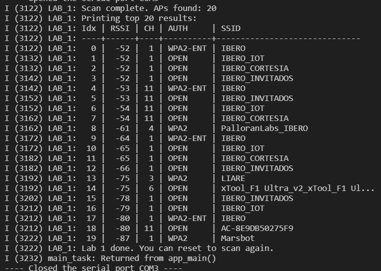

# Wi-FI Programming Lab: HTTP Server

**Session Purpose:**  
The general goal of this lab session is to develop the necessary skills to implement an ESP32-based embedded system with Wi-Fi connectivity and remote control capability via a web interface.

## Lab 1   
### 1) Activity Objectives    
_For this lab, we will create a list that will give us data about nearby Wi-Fi connections and modify the code to sort the results by RSSI (from strongest to weakest signal)._  
1) SSID  
2) RSSI  
3) Channel  
4) Authentication mode (Open, WPA2, etc.)
---

### 2) Questions pt.1  
1) _What is the SSID of the strongest AP detected in your scan?_  
2) _What is the RSSI value of that AP?_  
3) _What authentication mode does that AP use?_  
4) _On which channel is that AP operating?_  
5) _Which channel had the most APs detected in your scan?_  
---

### 3) Materials & Setup  
**BOM (Bill of Materials)**

|#|Item|Qty|Link/Source|Cost (MXN)|Notes|
|---------|--------|------|--------|--------|--------|
|1|ESP32|1|amazon|$365|None|

**_Tools / Software_**   

* _OS/Environment: ESP-IDF with FreeRTOS on ESP32 (Windows)_  
* _Editors: VS Code with ESP-IDF extension, C/C++_  
* _Debug/Flash: ESP-IDF Monitor and flashing tools_  

**_Wiring / Safety_**  

* _Board power: USB 5 V from host PC_  
* _Peripherals: None required for this lab_  
* _Safety notes: Check USB connection and avoid disconnections during flashing_  
---

### 4) Procedure   
* _**Step 1:** Initialize the ESP32 Wi-Fi system._  
* _**Step 2:** Execute a scan of nearby Wi-Fi networks._  
* _**Step 3:** Retrieve information of the detected access points._  
* _**Step 4:** Sort the results by signal strength (RSSI)._  
* _**Step 5:** Display the results on the serial monitor._  
---

### 5) Analysis   
_The system allows scanning nearby Wi-Fi networks using the ESP32 Wi-Fi driver._  

_NVS initialization is required for the proper operation of the Wi-Fi subsystem._  

_The ESP32 operates in station mode to detect nearby access points._  

_RSSI allows determining the signal strength of each detected network._  

_The results were sorted by RSSI to show the network with the strongest signal first._  

_This allows identifying the best available network based on signal strength._  

---

### 6) Questions pt.2
1) _What is the SSID of the strongest AP detected in your scan?_    
IBERO    
2) _What is the RSSI value of that AP?_    
-52 dBm    
3) _What authentication mode does that AP use?_    
WPA2-ENT    
4) _On which channel is that AP operating?_    
Channel 1  
5) _Which channel had the most APs detected in your scan?_  
Channel 1     
---

### 7) Code  

```c  
/*
 * LAB 1 — Wi-Fi Scan
 *
 * Learning Goals:
 *  - The minimum initialization pipeline required for Wi-Fi in ESP-IDF
 *  - How to scan for Access Points (APs)
 *  - How to interpret RSSI, channel, and auth mode
 */

//Libraries for standard C functions 
#include <string.h>
#include <stdio.h>
//Libraries for FreeRTOS (task management)
#include "freertos/FreeRTOS.h"
#include "freertos/task.h"
//Libraries for ESP-IDF logging and error handling
#include "esp_log.h"
#include "esp_err.h"
//Libraries for Wi-Fi and related components
#include "nvs_flash.h"     // nvs_flash_init() lives here
#include "esp_netif.h"     // esp_netif_init(), esp_netif_create_default_wifi_sta() lives here
#include "esp_event.h"     // esp_event_loop_create_default() lives here
#include "esp_wifi.h"      // Wi-Fi driver + scan APIs live here

static const char *TAG = "LAB_1";//Tag for logging

/*
 * Function Use:
 * Convert auth mode enum to a readable string. Enum is a special type of data to define a series of named integer 
 * constants. This is useful for printing human-friendly output instead of numeric codes. 
 */
static const char *authmode_to_str(wifi_auth_mode_t a)
{
    /*Authentication is the process of verifying the identity of a device (phone, laptop) attempting to connect to a wireless network before granting access.*/
    switch (a) {
        case WIFI_AUTH_OPEN:            return "OPEN";
        case WIFI_AUTH_WEP:             return "WEP";
        case WIFI_AUTH_WPA_PSK:         return "WPA";
        case WIFI_AUTH_WPA2_PSK:        return "WPA2";
        case WIFI_AUTH_WPA_WPA2_PSK:    return "WPA/WPA2";
        case WIFI_AUTH_WPA2_ENTERPRISE: return "WPA2-ENT";
        case WIFI_AUTH_WPA3_PSK:        return "WPA3";
        case WIFI_AUTH_WPA2_WPA3_PSK:   return "WPA2/WPA3";
        default:                        return "UNKNOWN";
    }
}

/*
 * Function Use:
 * Perform a Wi-Fi scan and print top N results.
 * Note: This Lab does not connect to any network yet.
 */
static void wifi_scan_and_print(void)
{
    // Scan configuration:
    // - channel=0 means "scan all channels"
    // - ssid/bssid NULL means "no filter, include all"
    // - show_hidden=true includes SSIDs that do not broadcast (rare, but useful)
    wifi_scan_config_t scan_cfg = {
        .ssid = NULL,
        .bssid = NULL,
        .channel = 0,
        .show_hidden = true,

        // You can later introduce active/passive scan options if desired:
        // .scan_type = WIFI_SCAN_TYPE_ACTIVE,
        // .scan_time.active.min = 100,
        // .scan_time.active.max = 300
    };

    ESP_LOGI(TAG, "Starting Wi-Fi scan (blocking until complete)...");
    ESP_ERROR_CHECK(esp_wifi_scan_start(&scan_cfg, true)); // true = block until done

    // Get how many APs were found
    uint16_t ap_count = 0;
    ESP_ERROR_CHECK(esp_wifi_scan_get_ap_num(&ap_count));
    ESP_LOGI(TAG, "Scan complete. APs found: %u", ap_count);

    // Limit how many records we read to avoid huge stack usage
    const uint16_t MAX_AP_PRINT = 20;
    wifi_ap_record_t ap_records[MAX_AP_PRINT];

    uint16_t number = (ap_count < MAX_AP_PRINT) ? ap_count : MAX_AP_PRINT;

    // Read up to 'number' records into ap_records[]
    ESP_ERROR_CHECK(esp_wifi_scan_get_ap_records(&number, ap_records));

    ESP_LOGI(TAG, "Printing top %u results:", number);
    ESP_LOGI(TAG, "Idx | RSSI | CH | AUTH     | SSID");
    ESP_LOGI(TAG, "----+------+----+----------+------------------------------");

    for (int i = 0; i < number; i++) {
        // RSSI: closer to 0 is stronger (e.g., -35 is strong, -85 is weak)
        // primary: channel number
        // ssid: AP name (null-terminated string)
        ESP_LOGI(TAG, "%3d | %4d | %2d | %-8s | %s",
                 i,
                 ap_records[i].rssi,
                 ap_records[i].primary,
                 authmode_to_str(ap_records[i].authmode),
                 (char *)ap_records[i].ssid);
    }

}

/*
 * Minimal Wi-Fi initialization required before scanning.
 * Order matters:
 *  1) NVS
 *  2) netif
 *  3) event loop
 *  4) create default STA interface
 *  5) Wi-Fi init + set mode + start
 */
static void wifi_init_for_scan(void)
{
    // 1) NVS initialization (required by Wi-Fi)
    esp_err_t ret = nvs_flash_init();
    if (ret == ESP_ERR_NVS_NO_FREE_PAGES || ret == ESP_ERR_NVS_NEW_VERSION_FOUND) {
        // This can happen if flash partition was changed or NVS is corrupted.
        // Erase and re-init is a common recovery in labs.
        ESP_ERROR_CHECK(nvs_flash_erase());
        ESP_ERROR_CHECK(nvs_flash_init());
    } else {
        ESP_ERROR_CHECK(ret);
    }

    // 2) Initialize network interface layer
    ESP_ERROR_CHECK(esp_netif_init());

    // 3) Create the default event loop
    ESP_ERROR_CHECK(esp_event_loop_create_default());

    // 4) Create default Wi-Fi STA interface
    esp_netif_create_default_wifi_sta();

    // 5) Initialize Wi-Fi driver
    wifi_init_config_t cfg = WIFI_INIT_CONFIG_DEFAULT();
    ESP_ERROR_CHECK(esp_wifi_init(&cfg));

    // Set station mode (we are a client, not an AP)
    ESP_ERROR_CHECK(esp_wifi_set_mode(WIFI_MODE_STA));

    // Start Wi-Fi driver (turns radio on and enables operations like scan)
    ESP_ERROR_CHECK(esp_wifi_start());

    ESP_LOGI(TAG, "Wi-Fi initialized and started in STA mode.");
}

void app_main(void)
{
    ESP_LOGI(TAG, "Lab 1 start: Wi-Fi scan demo.");

    wifi_init_for_scan();
    wifi_scan_and_print();

    ESP_LOGI(TAG, "Lab 1 done. You can reset to scan again.");
}
```  

---

### 8) Files & Media    
   



## Lab 2
### 1) Activity Objectives   
_In this lab, we will connect the ESP32 to an Access Point (AP) using SSID and password, and handle connection and disconnection events._  

We will observe and log:    
1) Wi-Fi driver start event  
2) Event of obtaining IP address  
3) Assigned IP address  
4) Number of connection retries  
5) Final result: success or failure  
---

### 2) Questions pt.1  
1) _Which event indicates that the Wi-Fi driver has started and is ready to connect?_  
2) _Which event indicates that the device obtained an IP address and is online?_  
3) _What is the assigned IP address?_  
4) _How many retries occurred before success or failure?_  
5) _Which occurred first: WIFI_EVENT_STA_START or IP_EVENT_STA_GOT_IP? Why?_  

---

### 3) Materials & Setup  
**BOM (Bill of Materials)**  

|#|Item|Qty|Link/Source|Cost (MXN)|Notes|  
|---------|--------|------|--------|--------|--------|  
|1|ESP32|1|amazon|$365|None|

---

**Tools / Software**

* OS/Environment: ESP-IDF with FreeRTOS on ESP32 (Windows)  
* Editors: VS Code with ESP-IDF extension, C/C++  
* Debug/Flash: ESP-IDF Monitor and flashing tools  
---

**Wiring / Safety**

* Board power: USB 5 V from host PC  
* No additional peripherals required  
* Ensure stable USB connection  
---

### 4) Procedure (what you did)
* **Step 1:** Initialize NVS required by the Wi-Fi system.  
* **Step 2:** Initialize network interface and event loop.  
* **Step 3:** Configure station mode (STA) with SSID and password.  
* **Step 4:** Register the Wi-Fi and IP event handler.  
* **Step 5:** Start the Wi-Fi driver.  
* **Step 6:** Wait for the successful connection event (IP obtained).  
* **Step 7:** Observe the connection result or failure in the terminal.  
---

### 5) Analysis  
_The system uses the ESP-IDF event-driven model to handle Wi-Fi connection._

_When the driver starts, the WIFI_EVENT_STA_START event is generated, which initiates the connection process._

_If the connection is successful, the system receives the IP_EVENT_STA_GOT_IP event, indicating the device is online._

_If a disconnection occurs, the system automatically attempts to reconnect until the maximum number of retries is reached._

_This mechanism allows a robust and fault-tolerant connection._

---

**This architecture demonstrates:**  
- Wi-Fi event handling  
- Station mode (STA) connection  
- Automatic IP address assignment via DHCP  
- Automatic reconnection on failure  
- Synchronization using Event Groups  
---

**Proposed improvements:**  

* Implement reconnection with exponential backoff.  
* Add visual indicator via LED for connection status.  
* Integrate HTTP server once connected. 

---

### 6) Questions pt.2  
1) _Which event indicates that the Wi-Fi driver has started and is ready to connect?_  
The event  ```WIFI_EVENT_STA_START -> Attempting connection...```  
2) _Which event indicates that the device obtained an IP address and is online?_  
The event is ```IP_EVENT_STA_GOT_IP```, located at line 57  
3) _What is the assigned IP address?_  
172.20.10.2  
4) _How many retries occurred before success or failure?_  
On the first attempt  
5) _Which occurred first: WIFI_EVENT_STA_START or IP_EVENT_STA_GOT_IP? Why?_   
WIFI_EVENT_STA_START occurs first because this event starts the search  

### 7) Code  
```c
/*
 * LAB 2 — Wi-Fi Station Connect + Reconnect (Improved Version)
 */

#include <string.h>
#include <stdio.h>
#include "freertos/FreeRTOS.h"
#include "freertos/event_groups.h"
#include "esp_log.h"
#include "esp_err.h"
#include "nvs_flash.h"
#include "esp_netif.h"
#include "esp_event.h"
#include "esp_wifi.h"

static const char *TAG = "LAB_2";

/* Event group */
static EventGroupHandle_t s_wifi_event_group;
#define WIFI_CONNECTED_BIT BIT0
#define WIFI_FAIL_BIT      BIT1

#ifndef WIFI_SSID
#define WIFI_SSID "iPhone de Jose MARIA"
#endif

#ifndef WIFI_PASS
#define WIFI_PASS "123456789"
#endif

static int s_retry = 0;
#define MAX_RETRY 10

/* Event handler */
static void wifi_event_handler(void *arg,
                               esp_event_base_t event_base,
                               int32_t event_id,
                               void *event_data)
{
    if (event_base == WIFI_EVENT && event_id == WIFI_EVENT_STA_START) {
        ESP_LOGI(TAG, "WIFI_EVENT_STA_START -> Attempting connection...");
        esp_wifi_connect();
    }

    else if (event_base == WIFI_EVENT && event_id == WIFI_EVENT_STA_DISCONNECTED) {

        if (s_retry < MAX_RETRY) {
            s_retry++;
            ESP_LOGW(TAG, "Disconnected! Retry attempt %d of %d",
                     s_retry, MAX_RETRY);
            esp_wifi_connect();
        } else {
            ESP_LOGE(TAG, "Maximum retries reached. Connection failed.");
            xEventGroupSetBits(s_wifi_event_group, WIFI_FAIL_BIT);
        }
    }

    else if (event_base == IP_EVENT && event_id == IP_EVENT_STA_GOT_IP) {

        ip_event_got_ip_t *event = (ip_event_got_ip_t *)event_data;

        ESP_LOGI(TAG, "IP_EVENT_STA_GOT_IP");
        ESP_LOGI(TAG, "Assigned IP: " IPSTR, IP2STR(&event->ip_info.ip));

        s_retry = 0;

        xEventGroupSetBits(s_wifi_event_group, WIFI_CONNECTED_BIT);
    }
}

/* Wi-Fi STA Initialization */
static void wifi_init_sta(void)
{
    s_wifi_event_group = xEventGroupCreate();

    ESP_ERROR_CHECK(esp_netif_init());
    ESP_ERROR_CHECK(esp_event_loop_create_default());
    esp_netif_create_default_wifi_sta();

    wifi_init_config_t cfg = WIFI_INIT_CONFIG_DEFAULT();
    ESP_ERROR_CHECK(esp_wifi_init(&cfg));

    ESP_ERROR_CHECK(esp_event_handler_register(
        WIFI_EVENT, ESP_EVENT_ANY_ID, &wifi_event_handler, NULL));

    ESP_ERROR_CHECK(esp_event_handler_register(
        IP_EVENT, IP_EVENT_STA_GOT_IP, &wifi_event_handler, NULL));

    wifi_config_t wifi_config = {0};

    strncpy((char *)wifi_config.sta.ssid,
            WIFI_SSID,
            sizeof(wifi_config.sta.ssid));

    strncpy((char *)wifi_config.sta.password,
            WIFI_PASS,
            sizeof(wifi_config.sta.password));

    ESP_LOGI(TAG, "Connecting to SSID: %s", WIFI_SSID);

    ESP_ERROR_CHECK(esp_wifi_set_mode(WIFI_MODE_STA));
    ESP_ERROR_CHECK(esp_wifi_set_config(WIFI_IF_STA, &wifi_config));
    ESP_ERROR_CHECK(esp_wifi_start());
}

/* Main */
void app_main(void)
{
    ESP_LOGI(TAG, "LAB 2 — Wi-Fi STA Connect + Reconnect");

    esp_err_t ret = nvs_flash_init();
    if (ret == ESP_ERR_NVS_NO_FREE_PAGES ||
        ret == ESP_ERR_NVS_NEW_VERSION_FOUND) {

        ESP_ERROR_CHECK(nvs_flash_erase());
        ESP_ERROR_CHECK(nvs_flash_init());
    } else {
        ESP_ERROR_CHECK(ret);
    }

    wifi_init_sta();

    EventBits_t bits = xEventGroupWaitBits(
        s_wifi_event_group,
        WIFI_CONNECTED_BIT | WIFI_FAIL_BIT,
        pdFALSE,
        pdFALSE,
        pdMS_TO_TICKS(30000)
    );

    if (bits & WIFI_CONNECTED_BIT) {
        ESP_LOGI(TAG, "Connected! Ready for next steps.");
    }
    else if (bits & WIFI_FAIL_BIT) {
        ESP_LOGE(TAG, "Connection failed after maximum retries.");
    }
    else {
        ESP_LOGE(TAG, "Timeout waiting for Wi-Fi connection.");
    }
}
```  

---

### 8) Files & Media  
**Video:**  
<div style="position: relative; width: 100%; height: 0; padding-top: 56.25%; margin-bottom: 1em;">
  <iframe 
      src="https://www.youtube.com/embed/xpFk1EIxNgc"
      style="position: absolute; width: 100%; height: 100%; top: 0; left: 0; border: none;"
      allow="accelerometer; autoplay; clipboard-write; encrypted-media; gyroscope; picture-in-picture"
      allowfullscreen>
  </iframe>
</div>
<div style="position: relative; width: 100%; height: 0; padding-top: 56.25%; margin-bottom: 1em;">
  <iframe 
      src="https://www.youtube.com/embed/s6CSwf7eIqc"
      style="position: absolute; width: 100%; height: 100%; top: 0; left: 0; border: none;"
      allow="accelerometer; autoplay; clipboard-write; encrypted-media; gyroscope; picture-in-picture"
      allowfullscreen>
  </iframe>
</div>

## Lab 3
### 1) Activity Objectives
_In this lab, we will use the ESP32 to create an HTTP server that allows controlling physical hardware via a web page._

We will observe and log:  
1) HTTP server start  
2) Client connection from the browser  
3) HTTP request reception  
4) Activation or deactivation of physical hardware  
5) Server response to the client  

---

### 2) Materials & Setup  
**BOM (Bill of Materials)**

|#|Item|Qty|Link/Source|Cost (MXN)|Notes|
|---|---|---|---|---|---|
|1|ESP32|1|Amazon|$365|Main microcontroller|
|2|LED|1|Lab kit|$2|Device to control|
|3|220Ω Resistor|1|Lab kit|$1|LED protection|
|4|Breadboard & wires|1|Lab kit|$140|Connections|
---

**Tools / Software**  

* OS/Environment: ESP-IDF with FreeRTOS on ESP32 (Windows)  
* Editor: VS Code with ESP-IDF extension  
* ESP-IDF Serial Monitor  
* Web browser (Chrome, Edge, etc.)  
---

**Wiring / Safety**  

* LED connected to a GPIO configured as output  
* Series resistor with LED  
* Powered via USB 5V from PC  
* Check correct connection and LED polarity  
---

### 3) Procedure
* **Step 1:** Connect ESP32 to Wi-Fi in station (STA) mode  
* **Step 2:** Configure GPIO as digital output  
* **Step 3:** Initialize the HTTP server on ESP32  
* **Step 4:** Create a web page accessible from a browser  
* **Step 5:** Register handlers for HTTP requests  
* **Step 6:** Control the LED state according to the request received  
* **Step 7:** Verify hardware control from the browser  
---

### 4) Analysis  
_ESP32 functions as an HTTP server that allows controlling physical hardware via a web interface._

_When a client accesses the ESP32 IP address, the server sends a web page._

_This page contains controls that allow sending requests to the server._

_When the server receives a request, it executes an action on the GPIO._

_This enables remote control of physical devices over the network._  

---

**This architecture demonstrates:**

- HTTP server implementation on ESP32  
- Remote control of physical hardware  
- Handling HTTP GET requests  
- Software-hardware interaction  
- GPIO control over a network  
---

**Proposed improvements:**

* Control multiple devices  
* Advanced web interface  
* Authentication implementation  
* Control from the internet  
* Real-time communication support  
---

### 5) Code  
```c
/*
 * LAB 3 — ESP32-C6 Wi-Fi + HTTP LED Control 
 *
 * Features:
 *  - Wi-Fi STA connect + reconnect using events
 *  - Wait for IP (WIFI_CONNECTED_BIT)
 *  - Simple GPIO LED control (gpio_reset_pin + gpio_set_direction)
 *  - HTTP server:
 *      GET  /         -> HTML UI
 *      GET  /api/led  -> JSON {"state":0|1}
 *      POST /api/led  -> JSON {"state":0|1} sets LED, returns {"ok":true}
 *
 */
// String handling and standard libraries
#include <string.h>
#include <stdio.h>
#include <stdlib.h>
// FreeRTOS and event groups
#include "freertos/FreeRTOS.h"
#include "freertos/event_groups.h"
// ESP-IDF Logging and error handling
#include "esp_log.h"
#include "esp_err.h"
// Wi-Fi and network
#include "nvs_flash.h"
#include "esp_netif.h"
#include "esp_event.h"
#include "esp_wifi.h"
// GPIO control
#include "driver/gpio.h"
// HTTP server
#include "esp_http_server.h"

/* ===================== User config ===================== */
#define WIFI_SSID "SSID_HERE"
#define WIFI_PASS "PASS_HERE"

/* LED pin */
#define LED_GPIO  8

/* Reconnect policy */
#define MAX_RETRY 10

/* ===================== Globals ===================== */
static const char *TAG = "LAB_3";

// Wi-Fi event group and bit seen in Lab 2
static EventGroupHandle_t s_wifi_event_group;
#define WIFI_CONNECTED_BIT BIT0

static int s_retry = 0;            // Retry count for Wi-Fi reconnects
static int s_led_state = 0;        // 0=OFF, 1=ON
static httpd_handle_t s_server = NULL; // HTTP server handle

/* ===================== LED helpers ===================== */
static void led_init(void)
{
    gpio_reset_pin(LED_GPIO);
    gpio_set_direction(LED_GPIO, GPIO_MODE_OUTPUT);

    s_led_state = 0;
    gpio_set_level(LED_GPIO, s_led_state);

    ESP_LOGI(TAG, "LED initialized on GPIO %d (state=%d)", LED_GPIO, s_led_state);
}

static void led_set(int on)
{
    s_led_state = (on != 0);
    gpio_set_level(LED_GPIO, s_led_state);
    ESP_LOGI(TAG, "LED set to %d", s_led_state);
}

/* ===================== HTTP handlers ===================== */

static esp_err_t api_led_get(httpd_req_t *req)
{
    char resp[32];
    snprintf(resp, sizeof(resp), "{\"state\":%d}", s_led_state);

    httpd_resp_set_type(req, "application/json");
    httpd_resp_send(req, resp, HTTPD_RESP_USE_STRLEN);

    return ESP_OK;
}

static esp_err_t api_led_post(httpd_req_t *req)
{
    if (req->content_len <= 0 || req->content_len > 256) {
        httpd_resp_send_err(req, HTTPD_400_BAD_REQUEST, "Invalid Content-Length");
        return ESP_FAIL;
    }

    char buf[257] = {0};
    int received = httpd_req_recv(req, buf, req->content_len);
    if (received <= 0) {
        httpd_resp_send_err(req, HTTPD_400_BAD_REQUEST, "Empty body");
        return ESP_FAIL;
    }
    buf[received] = '\0';

    int state = -1;
    char *p = strstr(buf, "\"state\"");
    if (p) {
        p = strchr(p, ':');
        if (p) state = atoi(p + 1);
    }

    if (state != 0 && state != 1) {
        httpd_resp_send_err(req, HTTPD_400_BAD_REQUEST, "state must be 0 or 1");
        return ESP_FAIL;
    }

    led_set(state);

    httpd_resp_set_type(req, "application/json");
    httpd_resp_sendstr(req, "{\"ok\":true}");
    return ESP_OK;
}

static esp_err_t root_get_handler(httpd_req_t *req)
{
    static const char *INDEX_HTML =
        "<!doctype html>\n"
        "<html>\n"
        "<head>\n"
        "  <meta charset='utf-8'>\n"
        "  <meta name='viewport' content='width=device-width, initial-scale=1'>\n"
        "  <title>ESP32-C6 LED</title>\n"
        "</head>\n"
        "<body>\n"
        "  <h2>ESP32-C6 LED Control</h2>\n"
        "  <button onclick='setLed(1)'>ON</button>\n"
        "  <button onclick='setLed(0)'>OFF</button>\n"
        "  <p id='st'>State: ?</p>\n"
        "  <script>\n"
        "    async function refresh(){\n"
        "      const r = await fetch('/api/led');\n"
        "      const j = await r.json();\n"
        "      document.getElementById('st').innerText = 'State: ' + j.state;\n"
        "    }\n"
        "    async function setLed(v){\n"
        "      await fetch('/api/led', {\n"
        "        method: 'POST',\n"
        "        headers: {'Content-Type':'application/json'},\n"
        "        body: JSON.stringify({state:v})\n"
        "      });\n"
        "      refresh();\n"
        "    }\n"
        "    setInterval(refresh, 1000);\n"
        "    refresh();\n"
        "  </script>\n"
        "</body>\n"
        "</html>\n";

    httpd_resp_set_type(req, "text/html");
    httpd_resp_send(req, INDEX_HTML, HTTPD_RESP_USE_STRLEN);
    return ESP_OK;
}

static void http_server_start(void)
{
    httpd_config_t config = HTTPD_DEFAULT_CONFIG();
    ESP_ERROR_CHECK(httpd_start(&s_server, &config));
    ESP_LOGI(TAG, "HTTP server started");

    httpd_uri_t root = { .uri="/", .method=HTTP_GET, .handler=root_get_handler, .user_ctx=NULL };
    httpd_uri_t led_get = { .uri="/api/led", .method=HTTP_GET, .handler=api_led_get, .user_ctx=NULL };
    httpd_uri_t led_post = { .uri="/api/led", .method=HTTP_POST, .handler=api_led_post, .user_ctx=NULL };

    ESP_ERROR_CHECK(httpd_register_uri_handler(s_server, &root));
    ESP_ERROR_CHECK(httpd_register_uri_handler(s_server, &led_get));
    ESP_ERROR_CHECK(httpd_register_uri_handler(s_server, &led_post));

    ESP_LOGI(TAG, "Routes registered: /  ,  GET/POST /api/led");
}

/* ===================== Wi-Fi STA connect + events ===================== */

static void wifi_event_handler(void *arg, esp_event_base_t event_base, int32_t event_id, void *event_data)
{
    if (event_base == WIFI_EVENT && event_id == WIFI_EVENT_STA_START) {
        ESP_LOGI(TAG, "WIFI_EVENT_STA_START -> esp_wifi_connect()");
        ESP_ERROR_CHECK(esp_wifi_connect());
        return;
    }

    if (event_base == WIFI_EVENT && event_id == WIFI_EVENT_STA_DISCONNECTED) {
        if (s_retry < MAX_RETRY) {
            s_retry++;
            ESP_LOGW(TAG, "Disconnected. Retrying (%d/%d)...", s_retry, MAX_RETRY);
            ESP_ERROR_CHECK(esp_wifi_connect());
        } else {
            ESP_LOGE(TAG, "Failed to connect after %d retries.", MAX_RETRY);
        }
        return;
    }

    if (event_base == IP_EVENT && event_id == IP_EVENT_STA_GOT_IP) {
        ip_event_got_ip_t *event = (ip_event_got_ip_t *)event_data;
        ESP_LOGI(TAG, "Got IP: " IPSTR, IP2STR(&event->ip_info.ip));

        s_retry = 0;
        xEventGroupSetBits(s_wifi_event_group, WIFI_CONNECTED_BIT);
        return;
    }
}

static void wifi_init_sta(void)
{
    s_wifi_event_group = xEventGroupCreate();

    ESP_ERROR_CHECK(esp_netif_init());
    ESP_ERROR_CHECK(esp_event_loop_create_default());
    esp_netif_create_default_wifi_sta();

    wifi_init_config_t cfg = WIFI_INIT_CONFIG_DEFAULT();
    ESP_ERROR_CHECK(esp_wifi_init(&cfg));

    ESP_ERROR_CHECK(esp_event_handler_register(WIFI_EVENT, ESP_EVENT_ANY_ID, &wifi_event_handler, NULL));
    ESP_ERROR_CHECK(esp_event_handler_register(IP_EVENT, IP_EVENT_STA_GOT_IP, &wifi_event_handler, NULL));

    wifi_config_t wifi_config = {0};
    strncpy((char *)wifi_config.sta.ssid, WIFI_SSID, sizeof(wifi_config.sta.ssid));
    strncpy((char *)wifi_config.sta.password, WIFI_PASS, sizeof(wifi_config.sta.password));

    ESP_LOGI(TAG, "Configuring Wi-Fi STA: SSID='%s'", WIFI_SSID);

    ESP_ERROR_CHECK(esp_wifi_set_mode(WIFI_MODE_STA));
    ESP_ERROR_CHECK(esp_wifi_set_config(WIFI_IF_STA, &wifi_config));
    ESP_ERROR_CHECK(esp_wifi_start());
}

/* ===================== app_main ===================== */

void app_main(void)
{
    ESP_LOGI(TAG, "Lab 3 start: Wi-Fi + HTTP + LED control.");

    // NVS init (required by Wi-Fi)
    esp_err_t ret = nvs_flash_init();
    if (ret == ESP_ERR_NVS_NO_FREE_PAGES || ret == ESP_ERR_NVS_NEW_VERSION_FOUND) {
        ESP_ERROR_CHECK(nvs_flash_erase());
        ESP_ERROR_CHECK(nvs_flash_init());
    } else {
        ESP_ERROR_CHECK(ret);
    }

    // Connect to Wi-Fi (STA)
    wifi_init_sta();

    // Wait for "got IP" (connected)
    EventBits_t bits = xEventGroupWaitBits(
        s_wifi_event_group,
        WIFI_CONNECTED_BIT,
        pdFALSE,
        pdTRUE,
        pdMS_TO_TICKS(30000)
    );

    if (!(bits & WIFI_CONNECTED_BIT)) {
        ESP_LOGE(TAG, "Timeout waiting for Wi-Fi connection. Check SSID/PASS and 2.4 GHz.");
        return;
    }

    // Start peripherals + HTTP
    led_init();
    http_server_start();

    ESP_LOGI(TAG, "Open: http://<ESP_IP>/ from a device on the same network.");
}
```

---

### 6) Files & Media   

**Video:**  
<div style="position: relative; width: 100%; height: 0; padding-top: 56.25%; margin-bottom: 1em;">
  <iframe 
      src="https://www.youtube.com/embed/hk3MIXWvkFo"
      style="position: absolute; width: 100%; height: 100%; top: 0; left: 0; border: none;"
      allow="accelerometer; autoplay; clipboard-write; encrypted-media; gyroscope; picture-in-picture"
      allowfullscreen>
  </iframe>
</div>

## Lab 4
### 1) Activity Objectives
_In this lab, we will use the ESP32 to create a WebSocket server to communicate in real time with clients.  
This allows bidirectional communication for controlling devices or sending sensor data._

We will observe and log:  
1) WebSocket server initialization  
2) Client connection  
3) Sending and receiving messages  
4) Updating hardware or variables based on messages  
5) Logging events for analysis  

---

### 2) Materials & Setup  
**BOM (Bill of Materials)**

|#|Item|Qty|Link/Source|Cost (MXN)|Notes|
|---|---|---|---|---|---|
|1|ESP32|1|Amazon|$365|Main microcontroller|
|2|LED|1|Lab kit|$2|Device to control|
|3|Resistor 220Ω|1|Lab kit|$1|LED protection|
|4|Breadboard & wires|1|Lab kit|$140|Connections|
---

**Tools / Software**  

* OS/Environment: ESP-IDF with FreeRTOS on ESP32 (Windows)  
* Editor: VS Code with ESP-IDF extension  
* ESP-IDF Serial Monitor  
* Web browser (Chrome, Edge, etc.)  
---

**Wiring / Safety**  

* LED connected to a GPIO configured as output  
* Series resistor with LED  
* Powered via USB 5V from PC  
* Check correct connection and LED polarity  
---

### 3) Procedure
* **Step 1:** Connect ESP32 to Wi-Fi in STA mode  
* **Step 2:** Configure GPIO as output for LED  
* **Step 3:** Initialize the WebSocket server  
* **Step 4:** Wait for client connections  
* **Step 5:** Send and receive messages in real time  
* **Step 6:** Update the LED or variables based on received messages  
* **Step 7:** Log all events in the serial monitor for debugging  
---

### 4) Analysis  
_Using WebSockets allows real-time, bidirectional communication between the ESP32 and clients._

_When a client connects, the server can immediately send updates or receive commands without polling._

_This is ideal for applications like remote control, IoT dashboards, or live sensor monitoring._

_The ESP32 can handle multiple clients and push updates asynchronously._

---

**This architecture demonstrates:**

- WebSocket server implementation on ESP32  
- Real-time bidirectional communication  
- Control of hardware from web clients  
- Asynchronous event handling  
- Efficient network use compared to polling  

---

**Proposed improvements:**

* Support multiple devices simultaneously  
* Add authentication and encryption  
* Integrate with a web dashboard for multiple controls  
* Send sensor data continuously in JSON format  
* Visual feedback in the web UI for device state  

---

### 5) Code  
```c
/*
 * LAB 4 — ESP32 WebSocket Server + LED Control
 *
 * Features:
 *  - Wi-Fi STA connect + reconnect (Lab 2 style)
 *  - WebSocket server with real-time communication
 *  - LED control via WebSocket messages
 *  - Event logging for connection/disconnection/messages
 */

#include <string.h>
#include <stdio.h>
#include <stdlib.h>

#include "freertos/FreeRTOS.h"
#include "freertos/event_groups.h"

#include "esp_log.h"
#include "esp_err.h"
#include "nvs_flash.h"
#include "esp_netif.h"
#include "esp_event.h"
#include "esp_wifi.h"

#include "driver/gpio.h"

#include "esp_http_server.h"
#include "esp_websocket_server.h"

/* ===================== User config ===================== */
#define WIFI_SSID "SSID_HERE"
#define WIFI_PASS "PASS_HERE"

#define LED_GPIO  8
#define MAX_RETRY 10

static const char *TAG = "LAB_4";

/* Wi-Fi event group */
static EventGroupHandle_t s_wifi_event_group;
#define WIFI_CONNECTED_BIT BIT0

static int s_retry = 0;
static int s_led_state = 0;

/* WebSocket server handle */
static httpd_handle_t s_ws_server = NULL;

/* ===================== LED helpers ===================== */
static void led_init(void)
{
    gpio_reset_pin(LED_GPIO);
    gpio_set_direction(LED_GPIO, GPIO_MODE_OUTPUT);
    s_led_state = 0;
    gpio_set_level(LED_GPIO, s_led_state);
    ESP_LOGI(TAG, "LED initialized on GPIO %d", LED_GPIO);
}

static void led_set(int on)
{
    s_led_state = (on != 0);
    gpio_set_level(LED_GPIO, s_led_state);
    ESP_LOGI(TAG, "LED set to %d", s_led_state);
}

/* ===================== WebSocket handlers ===================== */
static esp_err_t ws_handler(httpd_req_t *req)
{
    /* Only handle WebSocket upgrade requests */
    if (req->method == HTTP_GET) {
        ESP_LOGI(TAG, "WebSocket GET request received");
        return ESP_OK;
    }
    return ESP_FAIL;
}

/* Example: send LED state update */
static void ws_send_led_state(httpd_handle_t server)
{
    char msg[32];
    snprintf(msg, sizeof(msg), "{\"led\":%d}", s_led_state);
    // TODO: send message to all connected clients
}

/* ===================== HTTP + WS server ===================== */
static void ws_server_start(void)
{
    httpd_config_t config = HTTPD_DEFAULT_CONFIG();
    ESP_ERROR_CHECK(httpd_start(&s_ws_server, &config));

    httpd_uri_t ws_uri = {
        .uri      = "/ws",
        .method   = HTTP_GET,
        .handler  = ws_handler,
        .user_ctx = NULL
    };

    ESP_ERROR_CHECK(httpd_register_uri_handler(s_ws_server, &ws_uri));

    ESP_LOGI(TAG, "WebSocket server started at /ws");
}

/* ===================== Wi-Fi STA connect + events ===================== */
static void wifi_event_handler(void *arg, esp_event_base_t event_base, int32_t event_id, void *event_data)
{
    if (event_base == WIFI_EVENT && event_id == WIFI_EVENT_STA_START) {
        ESP_LOGI(TAG, "WIFI_EVENT_STA_START -> esp_wifi_connect()");
        ESP_ERROR_CHECK(esp_wifi_connect());
        return;
    }
    if (event_base == WIFI_EVENT && event_id == WIFI_EVENT_STA_DISCONNECTED) {
        if (s_retry < MAX_RETRY) {
            s_retry++;
            ESP_LOGW(TAG, "Disconnected. Retrying (%d/%d)...", s_retry, MAX_RETRY);
            ESP_ERROR_CHECK(esp_wifi_connect());
        } else {
            ESP_LOGE(TAG, "Failed to connect after %d retries.", MAX_RETRY);
        }
        return;
    }
    if (event_base == IP_EVENT && event_id == IP_EVENT_STA_GOT_IP) {
        ip_event_got_ip_t *event = (ip_event_got_ip_t *)event_data;
        ESP_LOGI(TAG, "Got IP: " IPSTR, IP2STR(&event->ip_info.ip));
        s_retry = 0;
        xEventGroupSetBits(s_wifi_event_group, WIFI_CONNECTED_BIT);
        return;
    }
}

static void wifi_init_sta(void)
{
    s_wifi_event_group = xEventGroupCreate();
    ESP_ERROR_CHECK(esp_netif_init());
    ESP_ERROR_CHECK(esp_event_loop_create_default());
    esp_netif_create_default_wifi_sta();
    wifi_init_config_t cfg = WIFI_INIT_CONFIG_DEFAULT();
    ESP_ERROR_CHECK(esp_wifi_init(&cfg));
    ESP_ERROR_CHECK(esp_event_handler_register(WIFI_EVENT, ESP_EVENT_ANY_ID, &wifi_event_handler, NULL));
    ESP_ERROR_CHECK(esp_event_handler_register(IP_EVENT, IP_EVENT_STA_GOT_IP, &wifi_event_handler, NULL));

    wifi_config_t wifi_config = {0};
    strncpy((char *)wifi_config.sta.ssid, WIFI_SSID, sizeof(wifi_config.sta.ssid));
    strncpy((char *)wifi_config.sta.password, WIFI_PASS, sizeof(wifi_config.sta.password));

    ESP_LOGI(TAG, "Configuring Wi-Fi STA: SSID='%s'", WIFI_SSID);
    ESP_ERROR_CHECK(esp_wifi_set_mode(WIFI_MODE_STA));
    ESP_ERROR_CHECK(esp_wifi_set_config(WIFI_IF_STA, &wifi_config));
    ESP_ERROR_CHECK(esp_wifi_start());
}

/* ===================== app_main ===================== */
void app_main(void)
{
    ESP_LOGI(TAG, "Lab 4 start: Wi-Fi + WebSocket + LED control.");

    esp_err_t ret = nvs_flash_init();
    if (ret == ESP_ERR_NVS_NO_FREE_PAGES || ret == ESP_ERR_NVS_NEW_VERSION_FOUND) {
        ESP_ERROR_CHECK(nvs_flash_erase());
        ESP_ERROR_CHECK(nvs_flash_init());
    } else {
        ESP_ERROR_CHECK(ret);
    }

    wifi_init_sta();

    EventBits_t bits = xEventGroupWaitBits(
        s_wifi_event_group,
        WIFI_CONNECTED_BIT,
        pdFALSE,
        pdTRUE,
        pdMS_TO_TICKS(30000)
    );

    if (!(bits & WIFI_CONNECTED_BIT)) {
        ESP_LOGE(TAG, "Timeout waiting for Wi-Fi connection.");
        return;
    }

    led_init();
    ws_server_start();

    ESP_LOGI(TAG, "Connect a WebSocket client to ws://<ESP_IP>/ws");
}
```

---

### 6) Files & Media  

**Video:**  
<div style="position: relative; width: 100%; height: 0; padding-top: 56.25%; margin-bottom: 1em;">
  <iframe 
      src="https://www.youtube.com/embed/thb90UDVBoM"
      style="position: absolute; width: 100%; height: 100%; top: 0; left: 0; border: none;"
      allow="accelerometer; autoplay; clipboard-write; encrypted-media; gyroscope; picture-in-picture"
      allowfullscreen>
  </iframe>
</div>