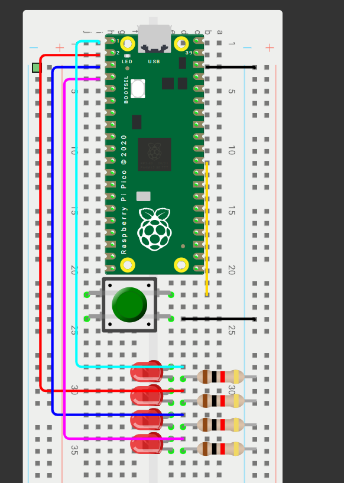
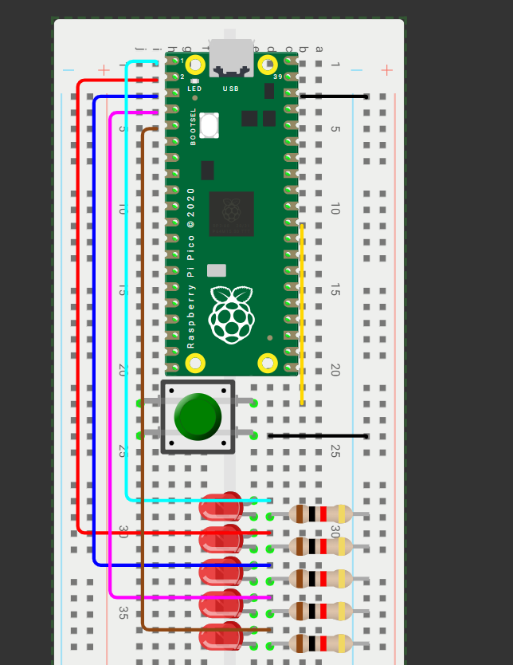
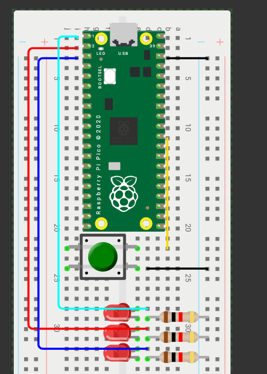

# 📚 **Tarea 2**

## **Introducción**

- **Nombre del proyecto:** _Outputs Basicos_  
- **Equipo / Autor(es):** _Rodrigo Miranda Flores_  
- **Curso / Asignatura:** _Sistemas embebidos 1_  
- **Fecha:** _27/08/2025_  
- **Descripción breve:** _En este apartado se muestran 3 ejercicios un Contador binario 4 bits, un barrido de 5 leds y una secuencia en codigo Gray._

### **Contador binario de 4 bits**

- **Que debe hacer:**
_En cuatro leds debe mostrarse cad segundo la representacion binaria del 0 al 15_

- **Codigo:**
``` 
#include "pico/stdlib.h"
#include "hardware/gpio.h"
#define A   0
#define B   1
#define C   2
#define D   3

int main() {
   const uint32_t MASK = (1u<<A) | (1u<<B) | (1u<<C) | (1u<<D);
   gpio_init_mask(MASK);
   gpio_set_dir_masked(MASK, MASK);  
   while (true) {
       for (uint8_t i = 0; i < 16; i++) {
           gpio_put_masked(MASK, i << A);
           sleep_ms(500);                
       }
   }
}
```

- **Esquematico de conexión:**


- **Video:**
[Video en Youtube](https://youtube.com/shorts/r_rv_efIPUs)


### **Barrido de 5 Leds**

- **Que debe hacer:**
_Correr un “1” por cinco LEDs P0..P3 y regresar (0→1→2→3→2→1…)_

- **Codigo:**
``` 
#include "pico/stdli-b.h"
#include "hardware/gpio.h"
#define A 0  
#define B 1  
#define C 2  
#define D 3
#define E 4  
int main() {
   const uint32_t MASK = (1u<<A) | (1u<<B) | (1u<<C) | (1u<<D) | (1u<<E);
   gpio_init_mask(MASK);
   gpio_set_dir_out_masked(MASK);  
   gpio_clr_mask(MASK);            
   while (true) {
       for (int i = 0; i < 5; ++i) {
           gpio_clr_mask(MASK);                
           gpio_set_mask(1 << i);              
           sleep_ms(300);
       }
       for (int i = 3; i > 0; --i) {
           gpio_clr_mask(MASK);
           gpio_set_mask(1 << i);
           sleep_ms(300);
       }
   }
}
```

- **Esquematico de conexión:**


- **Video:** 
[Video en Youtube](https://youtu.be/VObCDqgfttQ)


### **Secuencia en codigo Gray**

- **Que debe hacer:**
_En cuatro leds debe mostrarse cad segundo la representacion en codigo Gray del 0 al 15_

- **Codigo:**
```
#include "pico/stdlib.h"
#include "hardware/gpio.h"
#define A 0
#define B 1
#define C 2
uint8_t bin_gray(uint8_t num_dec) {
   return num_dec ^ (num_dec >> 1);
}
int main() {
   const uint8_t MASK = (1u << A) | (1u << B) | (1u << C);
   gpio_init_mask(MASK);
   gpio_set_dir_masked(MASK, MASK);
   while (true) {
       for (uint8_t i = 0; i < 8; i++) {
           uint8_t gray = bin_gray(i);
           gpio_put_masked(MASK, gray);
           sleep_ms(500);
       }
   }
}
```

- **Esquematico de conexión:**


- **Video:**
[Video en Youtube](https://youtube.com/shorts/lCM-7CqCMcQ)