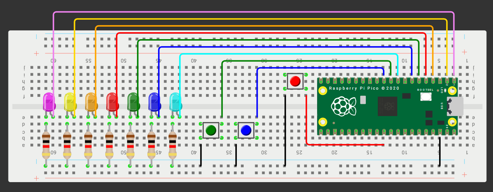

# 📚 **Tarea 4**

## **Introducción**

- **Nombre del proyecto:** _Led Pong_  
- **Equipo / Autor(es):** _Rodrigo Miranda Flores_  
- **Curso / Asignatura:** _Sistemas embebidos 1_  
- **Fecha:** _04/09/2025_  
- **Descripción breve:** _En este apartado se muestra el juego "Led Pong" hecho con una raspberry Pico 2._
### **LED PONG**

- **Que debe hacer:**
_Se trara de un mini-Pong con 5 LEDs en línea y 2 botones usando interrupciones (ISR) para registrar el “golpe” del jugador exactamente cuando la “pelota” (un LED encendido) llega al extremo de su lado._

- **Reglas del juego**
1) Pelota: es un único LED encendido que se mueve automáticamente de un extremo al otro (L1→L5→L1…) a un ritmo fijo.

2) Golpe con ISR: cada botón genera una interrupción.

* El BTN_L solo cuenta si, en el instante de la ISR, la pelota está en L1.

* El BTN_R solo cuenta si, en el instante de la ISR, la pelota está en L5.

* Si coincide, la pelota rebota: invierte su dirección.

* Si no coincide (la pelota no está en el último LED de ese lado), el botón se ignora.

3) Fallo y punto: si la pelota alcanza L1 y no hubo golpe válido del lado izquierdo en ese momento, anota el jugador derecho. Análogamente, si alcanza L5 sin golpe válido, anota el jugador izquierdo.

4) Indicador de punto: al anotar, se parpadea el LED de punto 3 veces del jugador que metió el punto .

5) Reinicio tras punto: después del parpadeo, la pelota se reinicia en el centro (L3) y comienza a moverse hacia el jugador que metió el punto.

6) Inicio del juego: al encender, la pelota inicia en L3 y no se mueve hasta que se presione un boton y debera moverse a la direccion opuesta del boton presionado.

- **Codigo:**
```
#include "pico/stdlib.h"
#include "hardware/gpio.h"
 
#define LED_P1 0
#define L1     1
#define L2     2
#define L3     3
#define L4     4
#define L5     5
#define LED_P2 6
 
#define BTN_L  7
#define BTN_R  8
 
volatile bool golpe_L = false;
volatile bool golpe_R = false;
int pos = L3;
int dir = 0;
 
void boton_isr(uint gpio, uint32_t events) {
    if (gpio == BTN_L) {
        if (pos == L1) golpe_L = true;
        else if (dir == 0) dir = 1;
    }
    else if (gpio == BTN_R) {
        if (pos == L5) golpe_R = true;
        else if (dir == 0) dir = -1;
    }
}
 
void parpadear_led(int led) {
    for (int i = 0; i < 3; i++) {
        gpio_put(led, 1);
        sleep_ms(200);
        gpio_put(led, 0);
        sleep_ms(200);
    }
}
 
void reiniciar_juego(int ganador) {
    parpadear_led(ganador);
    pos = L3;
    gpio_put(L3, 1);
   
    if (ganador == LED_P2) {
        dir = 1;
    } else if (ganador == LED_P1) {
        dir = -1;
    }
}
 
int main() {
    stdio_init_all();
 
    const uint32_t MASK = (1u<<LED_P1)|(1u<<L1)|(1u<<L2)|(1u<<L3)|(1u<<L4)|(1u<<L5)|(1u<<LED_P2);
    gpio_init_mask(MASK);
    gpio_set_dir_masked(MASK, MASK);
 
    gpio_init(BTN_L); gpio_set_dir(BTN_L, false); gpio_pull_up(BTN_L);
    gpio_init(BTN_R); gpio_set_dir(BTN_R, false); gpio_pull_up(BTN_R);
 
    gpio_set_irq_enabled_with_callback(BTN_L, GPIO_IRQ_EDGE_FALL, true, &boton_isr);
    gpio_set_irq_enabled(BTN_R, GPIO_IRQ_EDGE_FALL, true);
 
    int pos_anterior = L3;
    gpio_put(pos_anterior, 1);
 
    while (true) {
 
        gpio_put(pos_anterior, 0);
        gpio_put(pos, 1);
        pos_anterior = pos;
 
        sleep_ms(500);
 
        if (dir == 0) continue;
 
        if (pos == L1) {
            if (golpe_L) {
                dir = 1;
                golpe_L = false;
            } else {
                reiniciar_juego(LED_P2);
                continue;
            }
        } else if (pos == L5) {
            if (golpe_R) {
                dir = -1;
                golpe_R = false;
            } else {
                reiniciar_juego(LED_P1);
                continue;
            }
        }
 
        if (pos == L2 && golpe_L) {
            dir = 1;
            golpe_L = false;
        } else if (pos == L4 && golpe_R) {
            dir = -1;
            golpe_R = false;
        }
 
        pos += dir;
    }
}
```

- **Esquematico de conexion:** Se usó el mismo circuito para las 3 compuertas


- **Video:**

[Video en youtube](https://youtube.com/shorts/lCiT8hK5L0s)